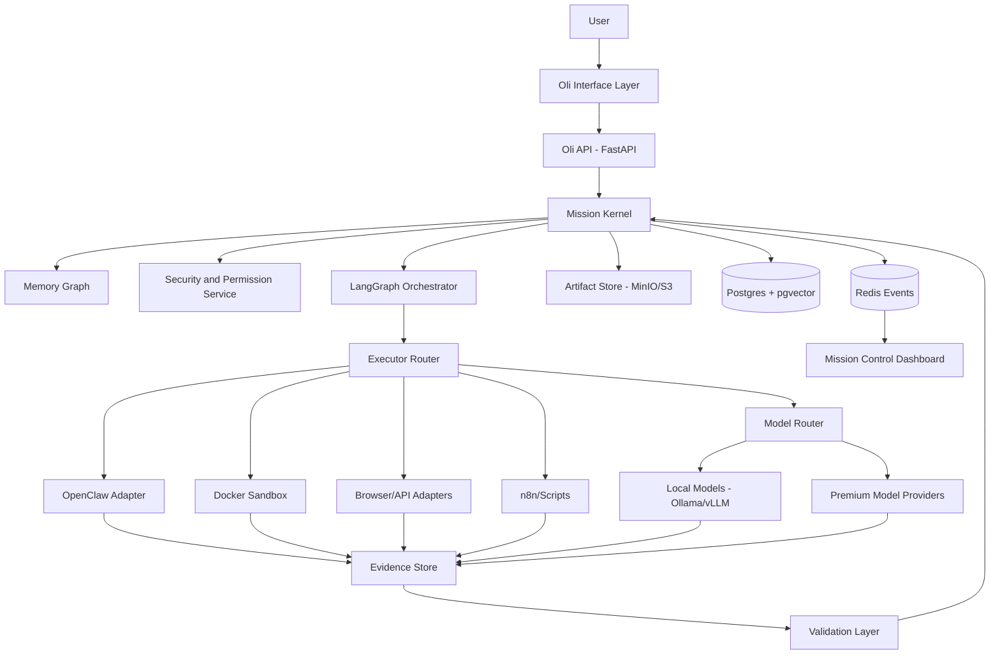
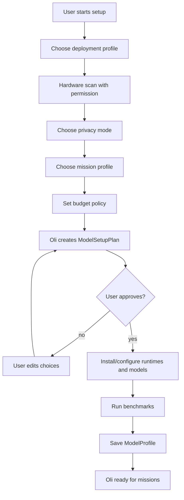
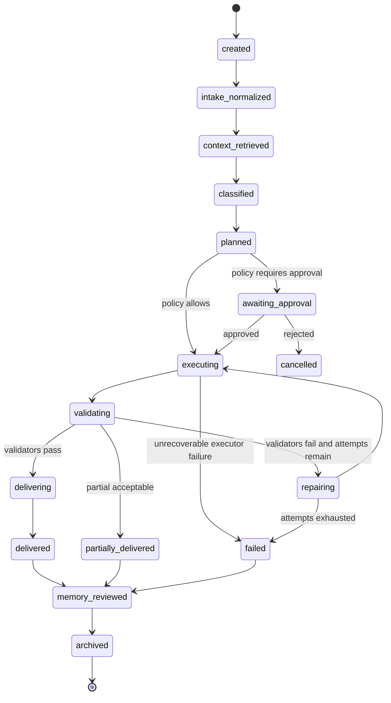
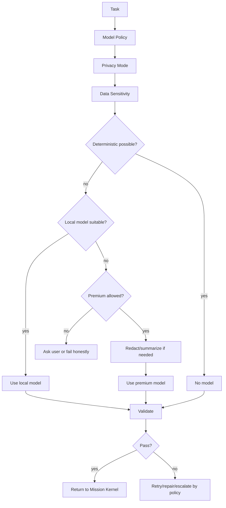
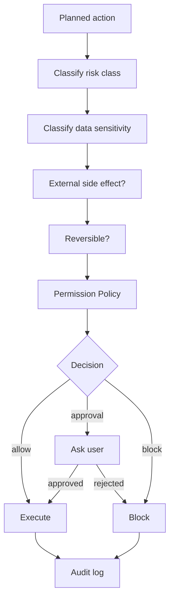
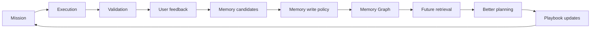
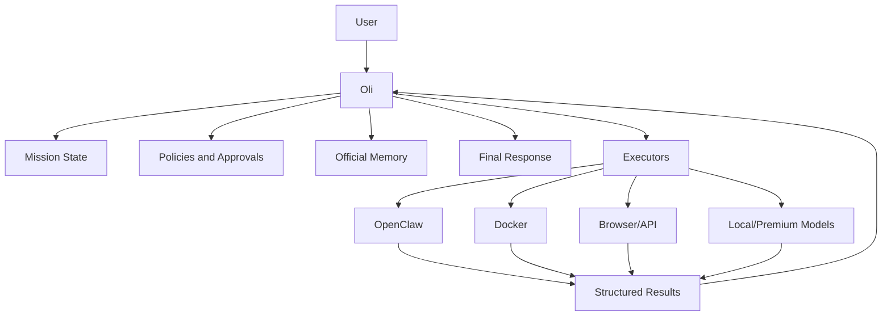

# 13 - Diagrams

## High-level architecture

## Setup and model selection

## Mission state machine

## Model routing

## Security gating

## Memory and self-improvement loop

## Oli/executor boundary

